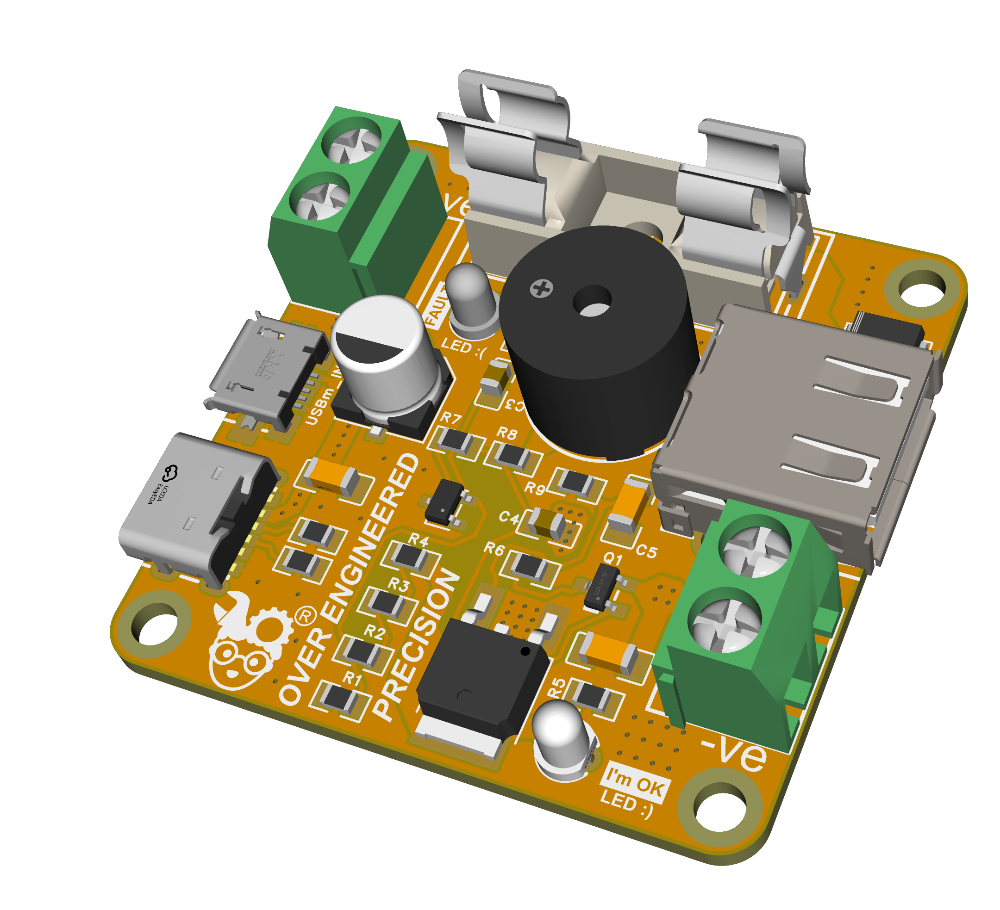
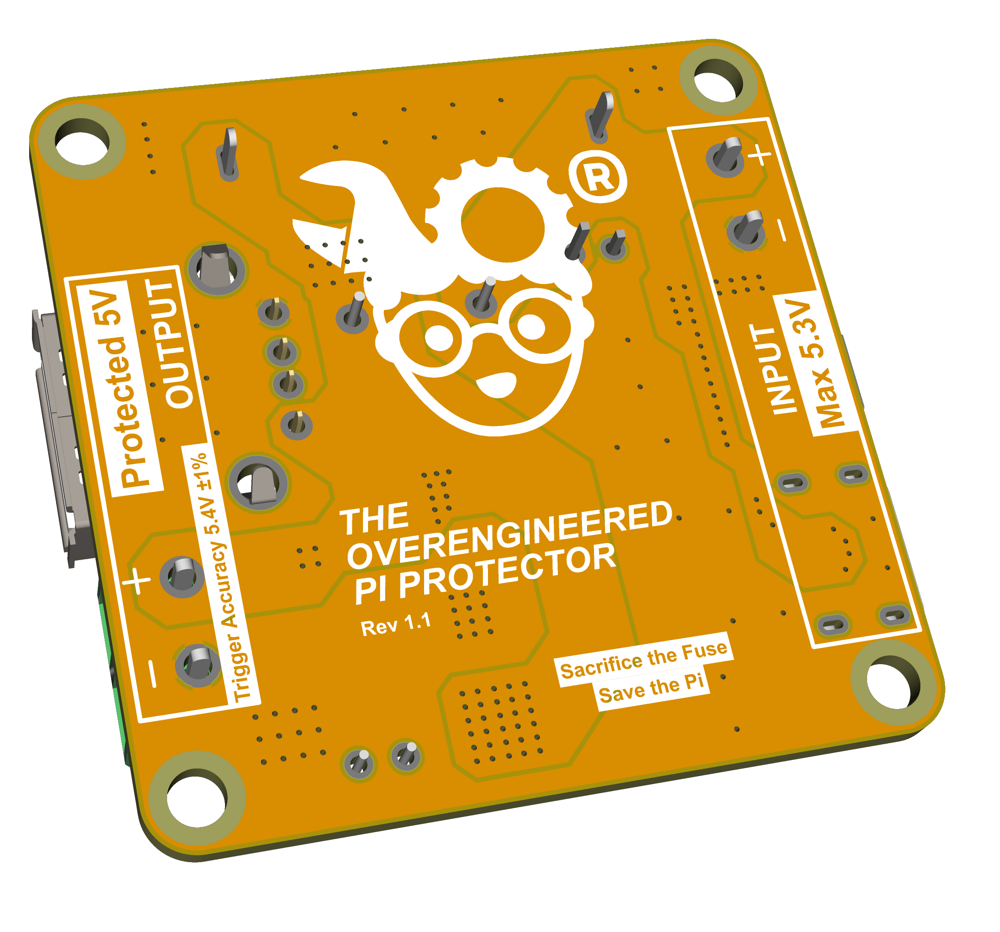
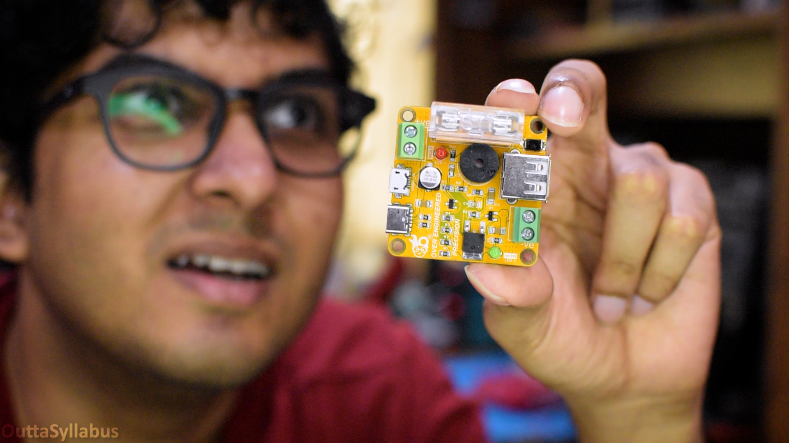

# The Overengineered Pi Protector

[![CC BY-NC-SA 4.0][cc-by-nc-sa-shield]][cc-by-nc-sa]
[![CC BY-NC-SA 4.0][cc-by-nc-sa-image]][cc-by-nc-sa]

Welcome to **The Overengineered Pi Protector**!

**Author:** Malhar Chakraborty - [Outta Syllabus](https://youtube.com/@OuttaSyllabus) YouTube channel.  
**Note:** This README is written by AI but verified by me, so no worries xD.

If you've ever had a [cheap, generic buck converter fail and kill your expensive Raspberry Pi 4 Model B 8GB](https://youtu.be/FCfD1nev3WU?si=QlLg1u7sAaED7ew6), you know the absolute heartbreak that follows. This project ensures that never happens again. 

This board sits between your power supply and your Pi. Under normal conditions, it does nothing. But the moment the voltage spikes past safe limits, it violently shorts the circuit to ground, blowing the inline fuse and saving your Pi. 

---

## 📸 Project Media

*(Check the `hardware/` folder for the full BOM and Gerber files to order your own from any PCB manufacturing service).*

---

### ✨ Features
* **Precision Voltage Trigger:** Uses a TL431 programmable reference to accurately detect overvoltage (set to trigger around 5.4V - 5.5V).
* **High-Speed Crowbar:** A BT151 SCR (Thyristor) slams the output to ground and pops the fuse in under 20 milliseconds (on 5A) when a fault is detected.
* **Transient Protection:** An onboard TVS Diode (SMBJ5.0A) clamps ultra-fast spikes while the SCR turns on.
* **Multiple Inputs/Outputs:** Supports Type-C, Micro-USB, and standard terminal blocks for maximum flexibility.
* **Audible & Visual Fault Indication:** A green LED indicates safe power. A red LED and an onboard buzzer scream at you when the fuse blows.

---

### 🧠 How the Circuit Works (& The Over-Engineering Decisions)

A "crowbar" circuit gets its name because it acts exactly like dropping a literal metal crowbar across your power rails. 

1. The **TL431** continuously monitors the input voltage via a precision resistor divider.
2. If the voltage crosses the ~5.4V threshold, the TL431 allows current to flow to the gate of the **BT151 SCR**.
3. The SCR activates, creating a massive, deliberate short circuit between VCC and Ground.
4. This short draws a massive amount of current, immediately popping the inline fuse (or triggering the Short Circuit protection of your PSU) and severing the connection to the Raspberry Pi.

**Why is it "Over-Engineered"?**
A basic, cheap crowbar circuit usually relies on a standard Zener diode to detect voltage spikes. We don't do that here in [Outta Syllabus](https://youtube.com/@OuttaSyllabus). To give the Pi the absolute best chance of survival, I built everything on this board to the highest hobbyist-grade standards possible:

*   **Precision Triggering:** The **TL431 precision shunt regulator** replaces the sloppy standard Zener diode, ensuring the over-voltage trigger point is razor-sharp and won't drift.
*   **High-Tolerance Resistors:** The resistor divider that controls the TL431 reference utilizes strict **1% and 0.5% tolerance** components for maximum accuracy.
*   **Automotive-Grade Stability:** I selected components with **AEC-Q100/Q200 ratings** wherever possible, guaranteeing rock-solid stability regardless of temperature or humidity fluctuations. 
*   **Premium Capacitors:** All ceramic capacitors are strictly **X7R rated MLCCs**, and the primary electrolytic capacitor is from **Nichicon**.

---

### 🛠️ Bill of Materials (BOM)

Here are the core components you'll need for assembly. *(See `PiProtectorBOM.csv` in the `hardware/` folder for more details).*

| Component | Qty |
| :--- | :---: |
| TL431 Precision Reference | 1 |
| BT151 SCR / Thyristor | 1 |
| SMBJ5.0A TVS Diode | 1 |
| 2N3906 PNP Transistor | 1 |
| 11kΩ Resistor (0805) | 1 |
| 10kΩ Resistor (0805) | 1 |
| 5.1kΩ Resistor (0805) | 2 |
| 4.7kΩ Resistor (0805) | 1 |
| 2.2kΩ Resistor (0805) | 1 |
| 1kΩ Resistor (0805) | 2 |
| 470Ω Resistor (0805) | 1 |
| 330Ω Resistor (0805) | 2 |
| 100Ω Resistor (0805) | 1 |
| 47µF Electrolytic Capacitor | 1 |
| 100nF Capacitor (1206) | 3 |
| 10nF Capacitor (0805) | 2 |
| 5V Active piezo Buzzer | 1 |
| Red LED (3mm THT) | 1 |
| Green LED (3mm THT) | 1 |
| USB Type-C Receptacle | 1 |
| Micro-USB Receptacle | 1 |
| USB Type-A Receptacle | 1 |
| 2-Pin Terminal Block | 2 |
| Inline Fuse Holder | 1 |

---

### 🚧 Assembly & Testing Notes (Don't repeat my mistakes)

Watch the full video [from here](https://www.youtube.com/watch?v=oqFYcszcCDM) LOL...

---

### 📝 License

This work is licensed under a
[Creative Commons Attribution-NonCommercial-ShareAlike 4.0 International License][cc-by-nc-sa].

[![CC BY-NC-SA 4.0][cc-by-nc-sa-image]][cc-by-nc-sa]

[cc-by-nc-sa]: http://creativecommons.org/licenses/by-nc-sa/4.0/
[cc-by-nc-sa-image]: https://licensebuttons.net/l/by-nc-sa/4.0/88x31.png
[cc-by-nc-sa-shield]: https://img.shields.io/badge/License-CC%20BY--NC--SA%204.0-lightgrey.svg
